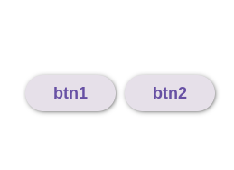

# Компонент BaseActionCard (Legacy)

Базовый компонент-контейнер для размещения действий (кнопок, ссылок и других интерактивных элементов). 

## Внешний вид  



## Props (Свойства)

| Свойство | Тип | Описание | По умолчанию |
|----------|-----|----------|--------------|
| `children` | `React.ReactNode` | Дочерние элементы (обычно кнопки или другие интерактивные элементы) | - |
| `className` | `string` | Дополнительные CSS-классы для кастомизации | - |

## Пример использования

```jsx
<BaseActionCard className="custom-actions">
  <Button>Сохранить</Button>
  <Button variant="outlined">Отмена</Button>
  <Link href="/help">Помощь</Link>
</BaseActionCard>
```
