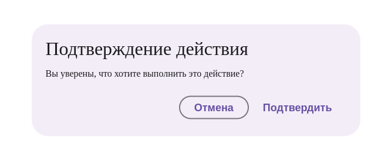

# Документация компонента BaseDialog

## Обзор
`BaseDialog` - это универсальный диалоговый компонент для отображения подтверждений, уведомлений и произвольного контента. Поддерживает стандартные и кастомные кнопки действий.

## Внешний вид  



## Пропсы

### Основные пропсы
| Проп                 | Тип                     | По умолчанию | Описание                                                                 |
|----------------------|-------------------------|--------------|-------------------------------------------------------------------------|
| `text`               | string                  | -            | Текст сообщения в диалоге                                              |
| `header`             | string                  | -            | Заголовок диалога                                                      |
| `actionText`         | string                  | "OK"         | Текст на кнопке действия                                               |
| `cancelText`         | string                  | "Отмена"     | Текст на кнопке отмены                                                 |
| `onSuccess`          | function                | -            | Колбек при подтверждении                                               |
| `onCancel`           | function                | -            | Колбек при отмене                                                      |
| `onHide`             | function                | -            | Колбек при закрытии (вызывается всегда)                                |
| `styleContainer`     | React.CSSProperties     | -            | Стили контейнера диалога                                               |
| `children`           | React.ReactNode         | -            | Дополнительный контент вместо текста                                   |
| `disableDefaultButtons` | boolean              | false        | Отключить стандартные кнопки                                           |
| `customActions`      | React.ReactNode         | -            | Кастомные кнопки действий                                              |

## Примеры использования

### Простой диалог подтверждения
```jsx
<BaseDialog
  header="Подтверждение удаления"
  text="Вы уверены, что хотите удалить этот элемент?"
  actionText="Удалить"
  cancelText="Отменить"
  onSuccess={handleDelete}
  onCancel={handleCancel}
/>
```

### Диалог с кастомным контентом
```jsx
<BaseDialog 
  header="Настройки"
  onHide={closeDialog}
>
  <div className="custom-content">
    {/* Кастомный контент */}
  </div>
</BaseDialog>
```

### Диалог с кастомными кнопками
```jsx
<BaseDialog
  header="Специальные действия"
  text="Выберите действие:"
  disableDefaultButtons
  customActions={
    <div className="custom-actions">
      <Button onClick={action1}>Действие 1</Button>
      <Button onClick={action2}>Действие 2</Button>
    </div>
  }
/>
```

## Особенности работы

1. **Обработка событий**:
   - `onSuccess` вызывается при подтверждении (клик по action кнопке)
   - `onCancel` вызывается при отмене (клик по cancel кнопке)
   - `onHide` вызывается в любом случае при закрытии диалога

2. **Кастомизация**:
   - Можно полностью заменить стандартные кнопки через `customActions`
   - Можно отключить стандартные кнопки (`disableDefaultButtons`)
   - Поддерживается как простой текст (`text`), так и сложный контент (`children`)

3. **Композиция**:
   - Использует `BasicTemplateDialog` как базовый шаблон
   - Кнопки реализованы как отдельный компонент `BaseDialogButton`

## Рекомендации по использованию

1. Для простых подтверждений используйте пропсы `text`, `actionText`, `cancelText`
2. Для сложных сценариев используйте `children` и `customActions`
3. Всегда обрабатывайте `onHide` для корректного закрытия диалога
4. Для управления состоянием диалога используйте внешний стейт

```jsx
// Пример управления видимостью
const [isOpen, setIsOpen] = useState(false);

const handleClose = () => setIsOpen(false);

return (
  <>
    <Button onClick={() => setIsOpen(true)}>Открыть диалог</Button>
    {isOpen && (
      <BaseDialog
        header="Пример"
        text="Пример сообщения"
        onHide={handleClose}
      />
    )}
  </>
);
```