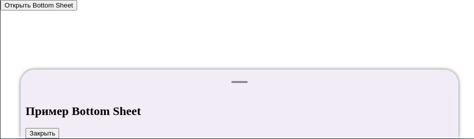

---

# BottomSheetsUi

`BottomSheetsUi` — это компонент, реализующий выезжающее снизу модальное окно (Bottom Sheet) с возможностью закрытия через свайп или клик.

## Внешний вид



## Свойства

| Свойство  | Тип                    | Описание  |
|-----------|------------------------|------------------------------------------------------------------------------------------------------------|
| `onHide`  | `() => void`           | Колбэк, вызываемый при закрытии Bottom Sheet. |
| `visible` | `boolean`              | Определяет, отображается ли Bottom Sheet. |
| `children` | `React.ReactNode` (необяз.) | Контент, который будет внутри Bottom Sheet. |
| `bottom`  | `number` (необяз.)      | Отступ снизу (по умолчанию `0`). |

## Использование

```tsx
import { BottomSheetsUi } from "./BottomSheetsUi";
import { useState } from "react";

const App = () => {
    const [isOpen, setIsOpen] = useState(false);

    return (
        <div>
            <button onClick={() => setIsOpen(true)}>Открыть Bottom Sheet</button>
            <BottomSheetsUi visible={isOpen} onHide={() => setIsOpen(false)}>
                <div className="bottom-sheet-content">
                    <h2>Пример Bottom Sheet</h2>
                    <button onClick={() => setIsOpen(false)}>Закрыть</button>
                </div>
            </BottomSheetsUi>
        </div>
    );
};

export default App;
```

## Описание логики

- **Закрытие Bottom Sheet**:
  - При свайпе вниз (по `touchMove` или `mouseMove`).
  - При переданном `onHide`, который вызывается с задержкой `200ms`.
  - При изменении `visible` в `false`.

- **Анимация скрытия**:
  - Класс `hide` применяется к `bottom-sheets`, плавно скрывая его.

