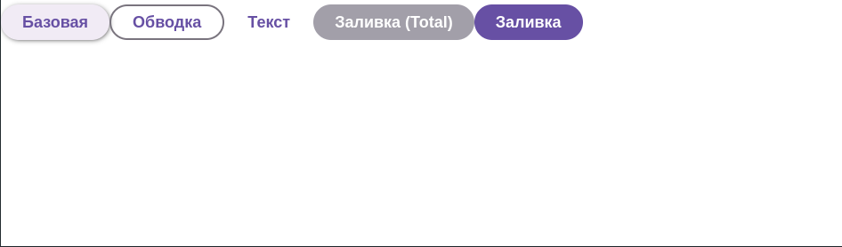

# Button  

`Button` — это универсальный компонент кнопки с поддержкой различных стилей.  

## Внешний вид  



## Свойства  

| Свойство     | Тип                               | Описание  |
|-------------|----------------------------------|------------------------------------------------------------------------------------------------|
| `styleType` | `"outline" \| "text" \| "filledTotal" \| "filled" \| "base"` (необяз.) | Определяет стиль кнопки. По умолчанию `"base"`. |
| `...props`  | `React.ButtonHTMLAttributes<HTMLButtonElement>` | Любые стандартные свойства кнопки (`onClick`, `disabled`, `className` и т. д.). |

## Использование  

```tsx
import { Button } from "./Button";

const App = () => (
    <div>
        <Button onClick={() => alert("Нажата базовая кнопка")}>Базовая</Button>
        <Button styleType="outline">Обводка</Button>
        <Button styleType="text">Текст</Button>
        <Button styleType="filledTotal">Заливка (Total)</Button>
        <Button styleType="filled">Заливка</Button>
    </div>
);

export default App;
```

## Описание логики  

- **Ripple-эффект:** При клике создается эффект волны (`btn-overlay`).  
- **Различные стили кнопки:**  
  - `"base"` — стандартная кнопка.  
  - `"outline"` — с обводкой.  
  - `"text"` — текстовая кнопка без фона.  
  - `"filledTotal"` — залитая кнопка с другим цветом.  
  - `"filled"` — залитая кнопка основного цвета.  
- **Обработчик `onClick`**:  
  - Добавляет `span.btn-overlay` для эффекта.  
  - Удаляет его через `500ms`.  

