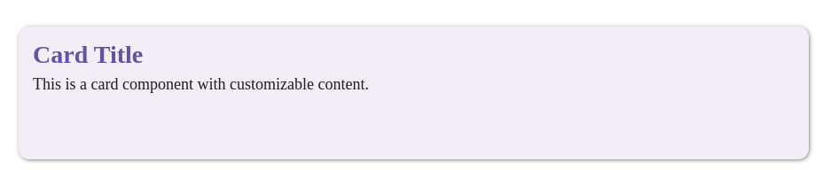

# Документация компонента Card

## Обзор

Компонент `Card` представляет собой универсальную карточку с поддержкой различных вариантов отображения контента, состояний и взаимодействий.

## Внешний вид  



## Пропсы

| Пропс            | Тип                     | По умолчанию  | Описание |
|------------------|-------------------------|---------------|----------|
| `action`        | `React.ReactNode`       | -             | Элементы действий (кнопки и т.д.) |
| `imgSrc`        | `string`                | -             | URL изображения |
| `alt`           | `string`                | -             | Альтернативный текст изображения |
| `header`        | `string`                | -             | Основной заголовок |
| `subhead`       | `string`                | -             | Подзаголовок |
| `text`          | `string`                | -             | Основной текст |
| `children`      | `React.ReactNode`       | -             | Дочерние элементы |
| `iconButtonCell`| `React.ReactNode`       | -             | Иконка/кнопка в заголовке |
| `variant`       | `'elevated'`, `'filled'`, `'outlined'` | `'elevated'` | Вариант стиля |
| `elevation`    | `number` (0-24)         | `6`          | Уровень тени (от 0 до 24). Работает при `'variant' = 'elevated'`|
| `loading`       | `boolean`               | `false`       | Состояние загрузки |
| `screenSize`    | `ScreenSize`            | -             | Размер экрана для адаптации |
| `rootApp`       | `string`                | `'#root'`     | CSS-селектор корневого элемента |
| `className`     | `string`                | -             | Дополнительные классы |
| `onClick`       | `(e: React.MouseEvent<HTMLDivElement>) => void` | - | Обработчик клика |

## Примеры использования

### Базовая карточка

```jsx
<Card 
  header="Заголовок"
  text="Основное содержимое карточки"
/>
```

### Карточка с изображением

```jsx
<Card
  imgSrc="/path/to/image.jpg"
  alt="Описание изображения"
  header="Заголовок"
  subhead="Подзаголовок"
  text="Текст карточки"
  variant="elevated"
/>
```

### Карточка с действиями

```jsx
<Card
  header="Карточка с действиями"
  text="Выберите действие:"
  action={
    <>
      <Button variant="text">Отмена</Button>
      <Button>Подтвердить</Button>
    </>
  }
/>
```

### Карточка в состоянии загрузки

```jsx
<Card
  header="Загрузка данных"
  loading={true}
/>
```

### Кастомная карточка

```jsx
<Card variant="outlined">
  <CustomChart />
  <div style={{ display: 'flex', justifyContent: 'space-between' }}>
    <Typography type="body">Статистика</Typography>
    <Button icon="refresh" variant="icon" />
  </div>
</Card>
```

## Варианты стилей

Компонент поддерживает три визуальных варианта:

1. **Elevated** (по умолчанию) - с тенью
   ```jsx
   <Card variant="elevated" />
   ```

2. **Filled** - с заполненным фоном
   ```jsx
   <Card variant="filled" />
   ```

3. **Outlined** - с границей
   ```jsx
   <Card variant="outlined" />
   ```

## Состояние загрузки

При установке пропса `loading={true}` карточка отображает индикатор загрузки:

```jsx
<Card loading={true} header="Загрузка..." />
```

## Особенности работы

1. **Ripple-эффект**: При клике на карточку появляется анимация волны.
2. **Адаптивность**: Автоматически адаптируется к разным размерам экрана.
3. **Оптимизация**: Изображения загружаются с атрибутом `loading="lazy"`.
4. **Доступность**: Поддерживает правильную семантику и ARIA-атрибуты.

## Рекомендации

1. Всегда указывайте `alt` текст для изображений
2. Для групп карточек используйте одинаковый `variant`
3. Сочетайте с компонентом `Typography` для единообразия текстов
4. Используйте состояние `loading` при асинхронной загрузке данных
5. Кастомизируйте через CSS-переменные для сохранения дизайн-системы