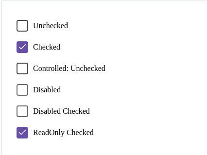

Вот документация для компонента `Checkbox`. Сохрани её в `Checkbox.md`:

---

# Checkbox

`Checkbox` — это компонент для отображения чекбокса с поддержкой кастомных иконок, размеров и состояния.

## Внешний вид  



## Свойства

| Свойство        | Тип                                   | Описание                                                                                           |
|-----------------|---------------------------------------|---------------------------------------------------------------------------------------------------|
| `checkIcon`     | `React.ReactNode` (необяз.)           | Кастомная иконка для отмеченного состояния (по умолчанию используется стандартная иконка `Check`). |
| `size`          | `'small' | 'medium' | 'large'` (необяз.) | Размер чекбокса. По умолчанию `'medium'`.                                                         |
| `name`          | `string` (необяз.)                    | Имя чекбокса, которое будет использоваться для передачи значения при отправке формы.              |
| `checked`       | `boolean` (необяз.)                   | Определяет, отмечен ли чекбокс.                                                                   |
| `onChange`      | `(e: React.ChangeEvent<HTMLInputElement>) => void` (необяз.) | Колбэк, вызываемый при изменении состояния чекбокса.                                               |
| `readOnly`      | `boolean` (необяз.)                   | Если `true`, чекбокс не может быть изменен.                                                       |
| `disabled`      | `boolean` (необяз.)                   | Если `true`, чекбокс будет заблокирован.                                                          |
| `className`     | `string` (необяз.)                    | Дополнительные классы для кастомизации стилей.                                                    |

## Использование

```tsx
import { Checkbox } from "./Checkbox";

const App = () => {
  const [checked, setChecked] = useState(false);

  const handleChange = (e: React.ChangeEvent<HTMLInputElement>) => {
    setChecked(e.target.checked);
  };

  return (
    <div>
      <Checkbox
        checked={checked}
        onChange={handleChange}
        size="large"
        checkIcon={<CustomCheckIcon />}
      />
    </div>
  );
};
```

## Описание логики

- **Кастомная иконка:** Вы можете передать свою иконку для отмеченного состояния через свойство `checkIcon`.
- **Размер:** Чекбокс поддерживает 3 размера: `small`, `medium` и `large` (по умолчанию `medium`).
- **Состояние:** Чекбокс может быть в одном из следующих состояний:
  - Отмечен (с помощью свойства `checked`).
  - Заблокирован (с помощью свойства `disabled`).
  - Только для чтения (с помощью свойства `readOnly`).


## Примечания

- Чекбокс использует `React.forwardRef` для передачи ссылки на элемент `input`, что позволяет работать с ним в родительских компонентах.
- Чекбокс поддерживает кастомные иконки для состояния "отмечено", и это поведение можно легко заменить.

