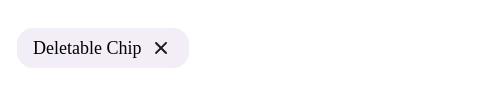

# Chips

`Chips` — это компонент для отображения чипсов (вкладок), с возможностью клика и удаления. Чипсы могут быть разных размеров и адаптироваться к различным экранам.

## Внешний вид  



## Свойства

| Свойство        | Тип                                     | Описание                                                                                           |
|-----------------|-----------------------------------------|---------------------------------------------------------------------------------------------------|
| `text`          | `string`                                | Текст, который будет отображаться внутри чипса.                                                    |
| `onClick`       | `(e: React.MouseEvent<HTMLDivElement>) => void` (необяз.) | Обработчик клика по чипсу.                                                                         |
| `onDelete`      | `(e: React.MouseEvent<HTMLButtonElement>) => void` (необяз.) | Обработчик удаления чипса (появляется только если передан).                                         |
| `big`           | `boolean` (необяз.)                     | Если `true`, чипс будет большого размера.                                                         |
| `screenSize`    | `ScreenSize` (необяз.)                  | Размер экрана для адаптивного отображения (например, для мобильных устройств).                    |
| `className`     | `string` (необяз.)                      | Дополнительные классы для кастомизации стилей.                                                    |

## Использование

```tsx
import { Chips } from "./Chips";

const App = () => {
  const handleChipClick = () => {
    console.log("Chip clicked");
  };

  const handleDelete = () => {
    console.log("Chip deleted");
  };

  return (
    <div>
      <Chips
        text="Example Chip"
        onClick={handleChipClick}
        onDelete={handleDelete}
        big
      />
    </div>
  );
};
```

## Описание логики

- **Удаление чипса:** Когда чипс имеет обработчик `onDelete`, появляется кнопка для удаления. Клик по кнопке вызовет переданный колбэк.
- **Клик по чипсу:** Если передан `onClick`, чипс можно кликать. Он будет вести себя как кнопка и использовать роль `button` для доступности.
- **Размер чипса:** Чипсы поддерживают два размера: маленький и большой. Если передано свойство `big`, чипс будет отображаться в увеличенном размере.
- **Адаптивность:** Чипсы поддерживают изменение внешнего вида в зависимости от размера экрана, используя свойство `screenSize`.

