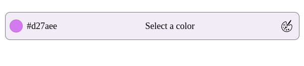

# Документация компонента ColorField

## Обзор

Компонент `ColorField` представляет собой поле выбора цвета, которое позволяет пользователям:
- Просматривать текущий цвет
- Открывать диалоговое окно выбора цвета
- Выбирать из предустановленных цветов
- Добавлять новые цвета в свою палитру

## Внешний вид  



## Пропсы

| Пропс | Тип | По умолчанию | Описание |
|-------|-----|--------------|----------|
| `value` | `string` | `"#f00"` | Текущее значение цвета в HEX-формате |
| `onChange` | `(value: string) => void` | - | Колбек при изменении цвета |
| `border` | `boolean` | `false` | Отображать рамку вокруг поля |
| `className` | `string` | `""` | Дополнительные CSS-классы |
| `container` | `HTMLElement \| null` | - | DOM-элемент для портала пикера цветов |
| `transparent` | `boolean` | `false` | Прозрачный фон поля |
| `placeholder` | `string` | - | Текст-заполнитель при отсутствии цвета |
| `userColors` | `string[]` | `[]` | Массив пользовательских цветов |
| `onAddColor` | `(colors: string[]) => void` | - | Колбек при добавлении нового цвета |
| `defaultColor` | `string` | - | Цвет по умолчанию в пикере |

## Примеры использования

### Базовое использование

```jsx
<ColorField 
  value="#3a86ff" 
  onChange={(color) => console.log(color)} 
  placeholder="Выберите цвет"
/>
```

### С рамкой и пользовательской палитрой

```jsx
<ColorField
  border
  userColors={['#ff0000', '#00ff00', '#0000ff']}
  onAddColor={(colors) => saveColors(colors)}
/>
```

### С прозрачным фоном

```jsx
<ColorField
  transparent
  value="#ffffff"
  onChange={handleColorChange}
/>
```

## Поведение

1. **Отображение цвета**:
   - Показывает текущий цвет в виде кружка
   - Отображает HEX-значение рядом

2. **Пикер цвета**:
   - Открывается по клику на любое место поля
   - Использует портал для рендеринга вне текущей иерархии DOM
   - Включает палитру пользовательских цветов (если предоставлена)

3. **Пользовательские цвета**:
   - При наличии `userColors` показывает их для быстрого выбора
   - При наличии `onAddColor` позволяет сохранять новые цвета

## Доступность

- Кружок цвета имеет `aria-label="Current color"`
- Иконка палитры имеет `aria-label="Open color picker"`
- Цвет текста автоматически контрастирует через хелпер `getTextColor`

## Рекомендации

1. **Указывайте цвет по умолчанию** для необязательных полей
2. **Используйте пропс container** для правильного позиционирования в модальных окнах
3. **Реализуйте onAddColor** для сохранения пользовательских цветов
4. **Добавляйте placeholder** для лучшего UX
5. **Учитывайте доступность** при выборе цветов по умолчанию