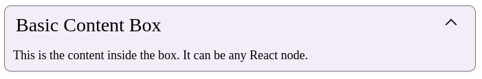

# Компонент ContentBox

Универсальный контейнер для контента с возможностью сворачивания и действиями.

## Возможности
- Настраиваемая рамка и стили
- Плавная анимация сворачивания с динамическим временем
- Опциональная кнопка действия
- Контролируемый и неконтролируемый режимы работы
- Адаптивный дизайн

## Использование
```tsx

<ContentBox 
  label="Пример контента" 
  border 
  collapsible
>
  <p>Ваш контент здесь</p>
</ContentBox>
```


## Внешний вид  



## Пропсы

| Пропс | Тип | По умолчанию | Описание |
|-------|-----|-------------|-----------|
| `label` | `string` | **Обязательный** | Заголовок контейнера |
| `children` | `ReactNode` | **Обязательный** | Содержимое контейнера |
| `border` | `boolean` | `false` | Отображать рамку вокруг компонента |
| `collapsible` | `boolean` | `false` | Можно ли сворачивать/разворачивать контент |
| `defaultVisible` | `boolean` | `false` | Начальное состояние видимости для сворачиваемого контента |
| `className` | `string` | `''` | Дополнительные классы для кастомного стиля |
| `style` | `React.CSSProperties` | `undefined` | Инлайн-стили для компонента |
| `action` | `ActionContentBox` | `undefined` | Конфигурация кнопки действия |
| `onVisibilityChange` | `(visible: boolean) => void` | `undefined` | Колбек при изменении видимости |

### Тип ActionContentBox
```ts
interface ActionContentBox {
  icon: React.ReactNode; // Иконка действия
  onClick: () => void; // Обработчик клика
  ariaLabel?: string; // Подпись для доступности
}
```

## Примеры

### Базовое использование
```tsx
<ContentBox label="Простой пример">
  <p>Это простой контейнер для контента</p>
</ContentBox>
```

### С рамкой
```tsx
<ContentBox label="Контейнер с рамкой" border>
  <p>Этот контейнер имеет рамку</p>
</ContentBox>
```

### Сворачиваемый контент
```tsx
<ContentBox 
  label="Сворачиваемый контейнер" 
  collapsible 
  defaultVisible
>
  <p>Кликните по заголовку, чтобы свернуть/развернуть</p>
</ContentBox>
```

### С кнопкой действия
```tsx
<ContentBox 
  label="С действием" 
  action={{
    icon: <PlusIcon />,
    onClick: () => console.log('Действие выполнено'),
    ariaLabel: "Добавить элемент"
  }}
>
  <p>Контент с кнопкой действия</p>
</ContentBox>
```

### Контролируемое использование
```tsx
const [isVisible, setIsVisible] = useState(true);

<ContentBox 
  label="Контролируемый пример"
  collapsible
  onVisibilityChange={setIsVisible}
>
  <p>Видимость контролируется извне: {isVisible ? 'Видно' : 'Скрыто'}</p>
</ContentBox>
```

## Решение проблем

**Анимация не плавная?**
- Проверьте, не меняется ли размер контента при анимации
- Ищите конфликты CSS-стилей

**Не работает навигация с клавиатуры?**
- Убедитесь, что родительские элементы не перехватывают события
- Проверьте дублирование tab-индексов

**Контент не сворачивается?**
- Убедитесь, что `collapsible` установлен в `true`
- Проверьте управление состоянием


