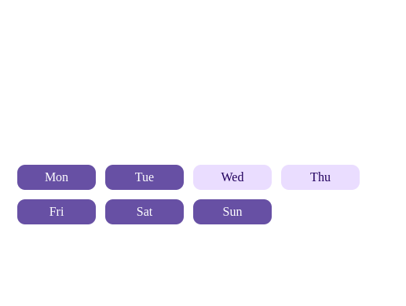

Вот полная документация в формате Markdown (MD) для вашего компонента `DayOfWeekField`:

# DayOfWeekField Component

Компонент для выбора дней недели в виде набора переключаемых кнопок.

## Внешний вид



## Использование

```tsx
import { DayOfWeekField } from '@your-org/day-of-week-field';

function SchedulePicker() {
  const [selectedDays, setSelectedDays] = useState<string[]>(['Mon', 'Wed', 'Fri']);

  return (
    <div>
      <h3>Select working days:</h3>
      <DayOfWeekField 
        value={selectedDays}
        onChange={setSelectedDays}
        className="custom-days-style"
      />
    </div>
  );
}
```
## Пропсы

| Пропс      | Тип                | По умолчанию | Описание |
|------------|--------------------|--------------|-----------|
| `value`    | `string[]`         | `[]`         | Массив выбранных дней (например `['Mon', 'Tue']`) |
| `onChange` | `(days: string[]) => void` | - | Колбек при изменении выбора |
| `className` | `string`          | -           | Дополнительный CSS-класс для контейнера |
| `dayLabels` | `Record<string, string>` | `{ Mon: 'Mon', Tue: 'Tue', Wed: 'Wed', Thu: 'Thu', Fri: 'Fri',Sat: 'Sat', Sun: 'Sun'}` |  Локализация дней недели |

## Формат дней

Компонент использует сокращенные англоязычные названия дней недели:

- `Mon` - Понедельник
- `Tue` - Вторник
- `Wed` - Среда
- `Thu` - Четверг
- `Fri` - Пятница
- `Sat` - Суббота
- `Sun` - Воскресенье

## Примеры

### Выбор рабочих дней
```tsx
<DayOfWeekField value={['Mon', 'Tue', 'Wed', 'Thu', 'Fri']} />
```

### Выбор выходных
```tsx
<DayOfWeekField value={['Sat', 'Sun']} />
```

### Полная неделя
```tsx
<DayOfWeekField value={['Mon', 'Tue', 'Wed', 'Thu', 'Fri', 'Sat', 'Sun']} />
```

### Кастомизация названий дней

Вы можете изменить отображаемые названия дней через пропс `dayLabels`:

```tsx
<DayOfWeekField 
  value={['Mon', 'Wed']}
  dayLabels={{
    Mon: 'Пн',
    Tue: 'Вт',
    Wed: 'Ср',
    Thu: 'Чт',
    Fri: 'Пт',
    Sat: 'Сб',
    Sun: 'Вс'
  }}
/>
```

## Доступность

Компонент реализует следующие практики доступности:

- Каждый день имеет метку (`aria-label`)
- Поддержка клавиатурной навигации (Tab, Space/Enter)

