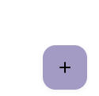

Вот документация для вашего компонента FAB в формате Markdown (`.md`):

# FAB (Floating Action Button)

## Внешний вид  



## Использование

### Базовая FAB
```jsx
<FAB icon={<PlusIcon />} />
```

### Extended FAB (с текстом)
```jsx
<FAB icon={<PlusIcon />} variant="primary">
  Создать
</FAB>
```

## Пропсы

| Проп          | Тип                                      | По умолчанию   | Описание                                                                 |
|---------------|------------------------------------------|----------------|-------------------------------------------------------------------------|
| `icon`        | `React.ReactNode`                        | —              | Иконка для отображения в кнопке                                        |
| `children`    | `React.ReactNode`                        | —              | Текст для Extended FAB                                                 |
| `size`        | `"small" \| "medium" \| "large"`        | `"medium"`     | Размер кнопки                                                          |
| `position`    | `"bottom-right" \| "bottom-left" \| "top-right" \| "top-left" \| "none"` | `"bottom-right"` | Позиционирование кнопки относительно родителя                          |
| `variant`     | `"primary" \| "secondary" \| "tertiary" \| "surface"` | `"primary"`    | Стиль кнопки                                                           |
| `className`   | `string`                                 | `""`           | Дополнительные CSS-классы                                              |
| ...props      | `React.ButtonHTMLAttributes<HTMLButtonElement>` | —              | Все стандартные пропсы кнопки (onClick, disabled и т.д.)               |

## Размеры

- `small` - Маленькая кнопка (40x40px)
- `medium` - Средняя кнопка (56x56px)
- `large` - Большая кнопка (96x96px)

## Варианты стилей

- `primary` - Основной акцентный цвет
- `secondary` - Второстепенный акцентный цвет
- `tertiary` - Третичный акцентный цвет
- `surface` - Стиль для поверхностей

## Позиционирование

Компонент поддерживает фиксированное позиционирование в углах экрана:

- `bottom-right` - Снизу справа (по умолчанию)
- `bottom-left` - Снизу слева
- `top-right` - Сверху справа
- `top-left` - Сверху слева
- `none` - Без позиционирования (для ручного размещения)

## Доступность

- Для кнопок без текста автоматически добавляется aria-label="Floating action button", если не указан другой `aria-label`
- Компонент использует HTML-элемент `<button>`, что обеспечивает стандартное поведение кнопки

## Кастомизация

Вы можете добавить собственные стили через проп `className` или переопределить CSS-переменные в SCSS:

```scss
.fab {
  --fab-primary-color: #your-color;
  --fab-elevation: 0 4px 8px rgba(0,0,0,0.2);
}
```

## Примеры

### FAB с кастомным позиционированием
```jsx
<FAB 
  icon={<Plus />} 
  size="large" 
  position="top-left"
  variant="tertiary"
/>
```


### Отключенная Extended FAB
```jsx
<FAB 
  icon={<SaveIcon />} 
  variant="tertiary"
  disabled
>
  Сохранить
</FAB>
```