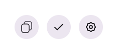

# IconButton

`IconButton` — это кнопка с иконкой, которая поддерживает различные стили, а также эффект ripple при клике и возможность настройки размера.

## Внешний вид  



## Свойства

| Свойство            | Тип                                         | Описание                                                                                         |
|---------------------|---------------------------------------------|-------------------------------------------------------------------------------------------------|
| `icon`              | `React.ReactNode`                           | Иконка, отображаемая внутри кнопки.                                                              |
| `className`         | `string` (необяз.)                          | Дополнительные классы для кнопки.                                                                |
| `classNameContainer`| `string` (необяз.)                          | Дополнительные классы для контейнера иконки.                                                     |
| `transparent`       | `boolean` (необяз.)                         | Если `true`, кнопка будет с прозрачным фоном.                                                    |
| `size`              | `'small' | 'medium' | 'large'` (необяз.)   | Размер кнопки. По умолчанию `medium`.                                                           |
| `disabled`          | `boolean` (необяз.)                         | Если `true`, кнопка будет недоступна для взаимодействия.                                         |
| `onClick`           | `(e: React.MouseEvent<HTMLButtonElement>) => void` (необяз.) | Обработчик клика по кнопке.                                                                      |
| `onContextMenu`     | `(e: React.MouseEvent<HTMLButtonElement>) => void` (необяз.) | Обработчик контекстного меню.                                                                   |
| `style`             | `React.CSSProperties` (необяз.)             | Дополнительные стили для кнопки.                                                                 |

## Использование

```tsx
import { IconButton } from "./IconButton";
import { SomeIcon } from "./Icons";

const App = () => {
  const handleClick = (e: React.MouseEvent<HTMLButtonElement>) => {
    console.log("Icon button clicked");
  };

  return (
    <div>
      <IconButton
        icon={<SomeIcon />}
        onClick={handleClick}
        size="small"
        transparent
      />
    </div>
  );
};
```

## Описание логики

- **Ripple-эффект**: При клике на кнопку создаётся анимация типа ripple. Эффект центрируется на месте клика, создавая визуально приятный эффект на кнопке.
- **Прозрачность**: Если передано свойство `transparent`, фон кнопки становится прозрачным.
- **Размер кнопки**: Поддерживаются три размера кнопок: `small`, `medium` и `large`.
- **Обработчики событий**: Кнопка поддерживает обработчики для обычного клика (`onClick`) и контекстного меню (`onContextMenu`).

