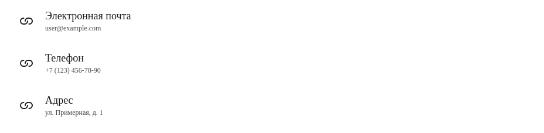

# Документация компонентов List

## Компонент ListContainer

Контейнер для списка элементов с поддержкой скролла и кастомизации.

## Внешний вид  



### Пропсы

| Проп          | Тип        | По умолчанию | Описание                                                                 |
|---------------|------------|--------------|-------------------------------------------------------------------------|
| `children`    | ReactNode  | -            | Дочерние элементы (обычно ListItem)                                    |
| `className`   | string     | ""           | Дополнительные классы                                                  |
| `maxHeight`   | string     | -            | Максимальная высота списка                                             |
| `scroll`      | boolean    | -            | Включить скролл при превышении maxHeight                               |
| `transparent` | boolean    | -            | Прозрачный фон контейнера                                              |
| `width`       | string     | -            | Ширина контейнера                                                      |
| `padding`     | string     | -            | Внутренние отступы                                                     |
| `margin`      | string     | -            | Внешние отступы                                                        |

### Пример использования
```jsx
<ListContainer 
  maxHeight="400px" 
  scroll 
  width="300px"
  padding="16px"
>
  <ListItem header="Элемент 1" />
  <ListItem header="Элемент 2" />
</ListContainer>
```

## Компонент ListItem

Элемент списка с поддержкой иконок, текста и управляющих элементов.

### Пропсы

| Проп           | Тип        | По умолчанию | Описание                                                                 |
|----------------|------------|--------------|-------------------------------------------------------------------------|
| `icon`         | ReactNode  | -            | Иконка элемента                                                        |
| `header`       | string     | -            | Заголовок элемента                                                     |
| `text`         | string     | -            | Основной текст элемента                                                |
| `description`  | string     | -            | Дополнительное описание                                                |
| `control`      | ReactNode  | -            | Элемент управления (кнопка, переключатель)                             |
| `value`        | string     | -            | Текстовое значение (альтернатива иконке)                               |
| `onClick`      | function   | -            | Обработчик клика                                                       |
| `hovered`      | boolean    | true         | Показывать hover-эффект                                                |
| `className`    | string     | ""           | Дополнительные классы                                                  |
| `disabled`     | boolean    | false        | Отключить элемент                                                      |
| `active`       | boolean    | false        | Выделить элемент как активный                                          |

### Пример использования
```jsx
<ListItem
  icon={<UserIcon />}
  header="Иван Иванов"
  text="Менеджер по продажам"
  description="Последний вход: сегодня"
  control={<Switch />}
  onClick={() => console.log('Клик по элементу')}
/>
```

## Особенности работы

1. **Доступность**:
   - Для отключенных элементов устанавливается `aria-disabled`
   - Поддерживается клавиатурная навигация

2. **Обработка кликов**:
   - Клики на управляющие элементы (control) не вызывают обработчик onClick элемента
   - Для отключенных элементов обработчик не вызывается

3. **Типография**:
   - Используется компонент Typography для текстовых элементов
   - Описание выводится второстепенным цветом

