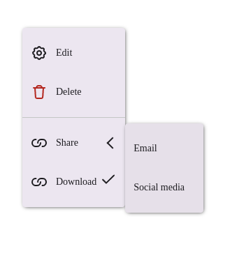

# Документация компонента Menu

## Обзор
Компонент `Menu` представляет собой адаптивное контекстное меню, которое автоматически подстраивается под размер экрана. На мобильных устройствах отображается полноэкранное меню, на десктопах - обычное контекстное меню.

## Внешний вид  



## Интерфейсы и типы

### IMenu (основные пропсы компонента)
| Свойство       | Тип               | По умолчанию | Описание                                                                 |
|----------------|-------------------|--------------|-------------------------------------------------------------------------|
| `blocks`       | `IBlock[]`        | -            | Массив блоков меню (обязательный)                                      |
| `visible`      | `boolean`         | -            | Флаг видимости меню (обязательный)                                     |
| `x`           | `number`          | -            | X-координата позиции меню (обязательный)                               |
| `y`           | `number`          | -            | Y-координата позиции меню (обязательный)                               |
| `container`    | `HTMLElement`     | `null`       | Контейнер для портала                                                  |
| `screensize`   | `ScreenSize`      | -            | Размер экрана (определяет адаптивную версию)                           |
| `width`       | `number`          | -            | Ширина меню                                                            |
| `autoHide`    | `boolean`         | -            | Автоматически скрывать меню при клике снаружи                          |
| `marginBottom`| `number`          | -            | Отступ снизу                                                           |
| `onHide`      | `() => void`      | -            | Колбек при скрытии меню                                                |
| `onClick`     | `() => void`      | -            | Колбек при клике на меню                                               |

### IBlock (блок меню)
| Свойство | Тип          | Описание                          |
|----------|--------------|-----------------------------------|
| `items`  | `IMenuItem[]`| Массив элементов меню             |

### IMenuItem (элемент меню)
| Свойство    | Тип               | Описание                          |
|-------------|-------------------|-----------------------------------|
| `title`     | `string`          | Текст элемента                    |
| `icon`      | `React.ReactNode` | Иконка элемента                   |
| `activated` | `boolean`         | Активное состояние                |
| `disabled`  | `boolean`         | Отключенное состояние             |
| `onClick`   | `() => void`      | Обработчик клика                  |
| `subItems`  | `IMenuSubItem[]`  | Подпункты меню                    |

### IMenuSubItem (подпункт меню)
| Свойство    | Тип               | Описание                          |
|-------------|-------------------|-----------------------------------|
| `title`     | `string`          | Текст подпункта                   |
| `icon`      | `React.ReactNode` | Иконка подпункта                  |
| `activated` | `boolean`         | Активное состояние                |
| `disabled`  | `boolean`         | Отключенное состояние             |
| `onClick`   | `() => void`      | Обработчик клика                  |

### ScreenSize (тип размера экрана)
```typescript
enum ScreenSize {
  MOBILE = 'mobile',
  DESKTOP = 'desktop'
}
```

## Примеры использования

### Базовое использование
```tsx
const [menuVisible, setMenuVisible] = useState(false);
const [menuPos, setMenuPos] = useState({ x: 0, y: 0 });

const handleContextMenu = (e: React.MouseEvent) => {
  e.preventDefault();
  setMenuPos({ x: e.clientX, y: e.clientY });
  setMenuVisible(true);
};

return (
  <div onContextMenu={handleContextMenu}>
    <Menu
      visible={menuVisible}
      x={menuPos.x}
      y={menuPos.y}
      onHide={() => setMenuVisible(false)}
      blocks={[
        {
          items: [
            {
              title: "Копировать",
              onClick: () => console.log("Копировать")
            },
            {
              title: "Вставить",
              disabled: true
            }
          ]
        }
      ]}
    />
  </div>
);
```

### Меню с подпунктами
```tsx
<Menu
  visible={visible}
  x={x}
  y={y}
  blocks={[
    {
      items: [
        {
          title: "Файл",
          subItems: [
            { title: "Новый" },
            { title: "Открыть" },
            { title: "Сохранить" }
          ]
        },
        {
          title: "Правка",
          subItems: [
            { title: "Отменить" },
            { title: "Повторить", disabled: true }
          ]
        }
      ]
    }
  ]}
/>
```

### Адаптивное меню
```tsx
<Menu
  visible={visible}
  x={x}
  y={y}
  screensize={isMobile ? ScreenSize.MOBILE : ScreenSize.DESKTOP}
  blocks={[...]}
/>
```

## Особенности реализации

1. **Адаптивность**:
   - На мобильных устройствах (`ScreenSize.MOBILE`) использует `SmallWindowMenu` (полноэкранный вариант)
   - На десктопах использует `BaseMenu` (контекстное меню)

2. **Порталы**:
   - Оба варианта меню рендерятся через `DialogModal` с возможностью указания контейнера

3. **Состояния элементов**:
   - Поддерживаются активные (`activated`) и отключенные (`disabled`) состояния
   - Поддерживаются вложенные меню (`subItems`)

4. **Поведение**:
   - Автоматическое скрытие при клике снаружи (`autoHide`)
   - Контроль позиции через `x` и `y` координаты

## Рекомендации по использованию

1. Для контекстных меню обрабатывайте событие `onContextMenu`
2. Управляйте видимостью через проп `visible`
3. Для сложных меню используйте вложенную структуру с `subItems`
4. На мобильных устройствах передавайте `ScreenSize.MOBILE`