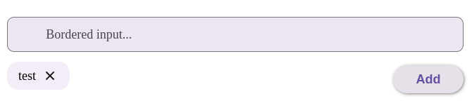

# MoreText

Компонент для добавления нескольких текстовых значений в виде чипсов с возможностью их удаления. Значения хранятся как объединенная строка, но отображаются как отдельные элементы.

## Внешний вид  



## Пропсы

| Проп                  | Тип                     | По умолчанию           | Описание |
|-----------------------|-------------------------|------------------------|----------|
| `value`               | `string`                | -                      | Текущее значение компонента (строка, объединенная через разделитель) |
| `onChange`            | `(value: string) => void` | -                      | Колбек при изменении значения |
| `border`             | `boolean`               | `false`                | Показать рамку вокруг поля ввода |
| `minWidth`           | `string`                | -                      | Минимальная ширина компонента |
| `placeholder`        | `string`                | `'Добавить значение'`  | Подсказка в поле ввода |
| `addButtonLabel`     | `string`                | `'Добавить'`           | Текст кнопки добавления |
| `separator`          | `string`                | `','`                  | Разделитель значений |
| `disabled`           | `boolean`               | `false`                | Отключить компонент |
| `className`          | `string`                | -                      | Дополнительный класс для стилизации |
| `ariaLabel`         | `string`                | `'Добавление нового элемента'` | ARIA-метка для поля ввода |
| `chipsAriaLabel`    | `string`                | `'Список элементов'`   | ARIA-метка для контейнера с чипсами |
| `id`                | `string`                | -                      | ID компонента (для ARIA-связей) |

## Примеры использования

### Базовый пример

```typescript
<MoreText 
  value={tags} 
  onChange={(newValue) => setTags(newValue)}
  placeholder="Введите теги"
/>
```

### С кастомным разделителем

```typescript
<MoreText 
  value={categories}
  onChange={setCategories}
  separator=";"
  addButtonLabel="Добавить категорию"
/>
```

### С отключенным состоянием

```typescript
<MoreText 
  value={readonlyTags}
  disabled={true}
/>
```

## Особенности работы

1. Значения хранятся в виде строки, разделенной указанным разделителем
2. При вводе значения можно добавлять:
   - Нажатием кнопки "Добавить"
   - Нажатием Enter в поле ввода
3. Пустые или повторяющиеся значения игнорируются
4. Компонент имеет полную поддержку accessibility (ARIA-атрибуты)

