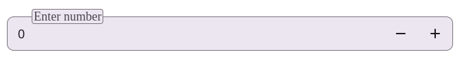

# `NumberField`

`NumberField` — это настраиваемый React-компонент числового ввода с поддержкой инкремента/декремента значений, кастомных иконок, обработки ошибок и доступности.

## Внешний вид  



## Пропсы

| Пропс | Тип | Описание |
|------|------|-------------|
| `value` | `number` | Текущее значение поля |
| `onChange` | `(value: number, name?: string) => void` | Колбэк при изменении значения |
| `name` | `string` | Имя поля |
| `placeholder` | `string` | Плейсхолдер |
| `validEmptyValue` | `boolean` | Если `true`, то пустое значение считается ошибочным |
| `className` | `string` | Дополнительные классы |
| `onFocus` | `(event: FocusEvent<HTMLInputElement>) => void` | Обработчик события `focus` |
| `onBlur` | `(event: FocusEvent<HTMLInputElement>) => void` | Обработчик события `blur` |
| `error` | `boolean` | Является ли поле с ошибкой |
| `errorText` | `string` | Текст ошибки, отображаемый под полем |
| `helperText` | `string` | Текст-подсказка, отображаемый под полем |
| `icon` | `ReactNode` | Иконка слева от поля |
| `onClear` | `() => void` | Обработчик клика на кнопку очистки значения |
| `border` | `boolean` | Добавляет обводку вокруг поля |
| `readOnly` | `boolean` | Делает поле только для чтения |
| `transparent` | `boolean` | Делает фон прозрачным |
| `min` | `number` | Минимальное допустимое значение |
| `max` | `number` | Максимальное допустимое значение |
| `step` | `number` | Шаг при изменении значения (по умолчанию `1`) |
| `refInput` | `RefObject<HTMLInputElement>` | Реф на HTML `input` элемент |
| `styleContainer` | `React.CSSProperties` | Стили контейнера |
| `size` | `"small" \| "medium" \| "large"` | Размер поля (по умолчанию `"medium"`) |
| `disabled` | `boolean` | Деактивирует поле |
| `ariaLabel` | `string` | Атрибут `aria-label` |
| `ariaLabelledby` | `string` | Атрибут `aria-labelledby` |
| `ariaDescribedby` | `string` | Атрибут `aria-describedby` |

## Особенности

- Поддержка автоинкремента/декремента при удержании кнопок `+` / `-`.
- Контроль допустимого диапазона значений (`min`, `max`).
- Возможность очищать поле с помощью иконки крестика (`X`).
- Управление фокусом через клики по иконке и контейнеру.
- Поддержка доступности (`aria-*` атрибуты).
- Проверка пустых значений и отображение ошибок/подсказок.

## Пример использования

```tsx
<NumberField
  name="quantity"
  value={5}
  onChange={(value) => console.log("Changed to:", value)}
  placeholder="Enter number"
  min={0}
  max={10}
  step={1}
  size="medium"
  errorText="Value is invalid"
  helperText="Allowed range is 0 to 10"
  icon={<MyCustomIcon />}
  onClear={() => console.log("Cleared")}
  border
/>
```

## 🔧 Внутренняя логика

- Значения изменяются с небольшой задержкой (debounced `onChange`).
- Автоинкремент/декремент реализован через `setTimeout` и `setInterval`.

