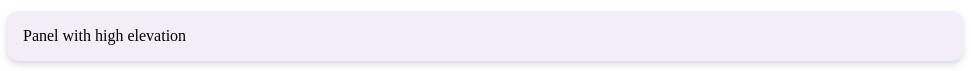

# Panel

Панель - это универсальный контейнер с настраиваемой тенью, отступами и скруглением углов.

## Внешний вид  



## Props

| Параметр       | Тип                     | По умолчанию | Описание                                                                 |
|----------------|-------------------------|--------------|--------------------------------------------------------------------------|
| `children`     | `React.ReactNode`       | -            | Содержимое панели                                                       |
| `className`    | `string`                | `''`         | Дополнительные CSS-классы                                               |
| `style`        | `React.CSSProperties`   | -            | Инлайн стили                                                            |
| `elevation`    | `number` (0-24)         | `1`          | Уровень тени (от 0 до 24)                                               |
| `padded`       | `boolean`               | `true`       | Имеет ли панель внутренние отступы (16px)                               |
| `borderRadius` | `number`                | `12`         | Закругление углов в пикселях                                            |

## Примеры использования

### Базовая панель
```jsx
<Panel>
    Контент панели
</Panel>
```

### Панель без отступов с тенью 3 уровня
```jsx
<Panel elevation={3} padded={false}>
    Контент без отступов
</Panel>
```

### Панель с кастомными стилями
```jsx
<Panel 
    style={{ backgroundColor: '#f0f0f0' }}
    borderRadius={8}
    className="custom-panel"
>
    Кастомная панель
</Panel>
```
