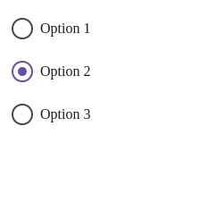

# Компонент RadioButton

## Обзор
`RadioButton` - это настраиваемый компонент радио-кнопки с поддержкой различных размеров, стилей и гибким управлением состоянием.



## Пропсы

### Обязательные пропсы
| Проп    | Тип     | Описание                          |
|---------|----------|--------------------------------------|
| `name`  | string   | Имя группы радио-кнопок      |

### Опциональные пропсы
| Проп            | Тип                     | По умолчанию    | Описание                                                                 |
|-----------------|--------------------------|------------|-----------------------------------------------------------------------------|
| `currentValue`  | string \| number        | -          | Текущее выбранное значение в группе (альтернатива `checked`)                |
| `value`         | string \| number         | -          | Значение этой радио-кнопки                                                |
| `label`         | string                   | -          | Текст метки рядом с кнопкой                                  |
| `size`          | "small" \| "medium" \| "large" | "medium"  | Размер радио-кнопки                                      |
| `variant`       | "primary" \| "secondary" \| "error" | "primary" | Стиль оформления                                                       |
| `showLabel`     | boolean                  | true       | Показывать ли текст метки                                          |
| `checked`       | boolean                  | -          | Управляемое состояние выбора                                                   |
| `defaultChecked`| boolean                  | -          | Начальное состояние выбора (неуправляемый режим)                                       |
| `readOnly`      | boolean                  | -          | Только для чтения                                           |
| `className`     | string                   | -          | Дополнительные CSS-классы для контейнера                                     |

## Примеры использования

### Базовое использование
```jsx
<RadioButton 
  name="gender" 
  value="male" 
  label="Мужской" 
/>
```

### Управляемый компонент
```jsx
const [selected, setSelected] = useState('option1');

<RadioButton
  name="options"
  value="option1"
  label="Вариант 1"
  currentValue={selected}
  onChange={(e) => setSelected(e.target.value)}
/>
```

### Неуправляемый компонент
```jsx
<RadioButton
  name="options"
  value="option2"
  label="Вариант 2"
  defaultChecked
/>
```

### Разные стили и размеры
```jsx
<RadioButton
  name="colors"
  value="red"
  label="Красный"
  variant="error"
  size="large"
/>
```

## Доступность
- Автоматически устанавливается атрибут `aria-checked`
- Если метка скрыта (`showLabel=false`), она используется как `aria-label`
- Поддерживаются стандартные атрибуты доступности

## Особенности работы
- Состояние выбора определяется:
  1. Совпадением `currentValue` и `value` (рекомендуется для групп)
  2. Пропом `checked` если указан
  3. Пропом `defaultChecked