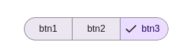

# Документация для SegmentedButton

## Обзор
Компонент `SegmentedButton` представляет собой группу кнопок, где можно выбрать один или несколько вариантов. Поддерживает разные размеры, стили и режимы выбора.

## Внешний вид  



## Пропсы

### Основные пропсы
| Проп        | Тип                     | По умолчанию | Описание                                                                 |
|-------------|-------------------------|--------------|-------------------------------------------------------------------------|
| `items`     | `string[]`              | -            | Массив элементов для отображения (обязательный)                         |
| `value`     | `string[]` \| `string`  | -            | Текущее выбранное значение/значения                                    |
| `multiple`  | `boolean`               | `false`      | Разрешить множественный выбор                                          |
| `name`      | `string`                | -            | Имя группы элементов                                                   |
| `readOnly`  | `boolean`               | `false`      | Режим только для чтения                                                |
| `onChange`  | `(value: string[], event?: React.MouseEvent) => void` | - | Обработчик изменения значения                                       |
| `size`      | `"small"` \| `"medium"` \| `"large"` | `"medium"` | Размер компонента                                                  |
| `variant`   | `"primary"` \| `"secondary"` \| `"surface"` | `"primary"` | Вариант стиля                                                   |

## Примеры использования

### Одиночный выбор
```jsx
const [selected, setSelected] = useState('');

<SegmentedButton
  items={['День', 'Неделя', 'Месяц']}
  value={selected}
  onChange={(value) => setSelected(value[0])}
/>
```

### Множественный выбор
```jsx
const [selected, setSelected] = useState<string[]>([]);

<SegmentedButton
  items={['Email', 'SMS', 'Push']}
  value={selected}
  multiple
  onChange={setSelected}
/>
```

### Неактивное состояние
```jsx
<SegmentedButton
  items={['Вариант 1', 'Вариант 2']}
  readOnly
/>
```

## Особенности работы

1. **Управление состоянием**:
   - Компонент может работать как в управляемом (`value` + `onChange`), так и в неуправляемом режиме
   - При `multiple=false` всегда выбирается только один элемент
   - При клике на уже выбранный элемент в режиме `multiple=false` выбор снимается

2. **Доступность**:
   - Используются ARIA-атрибуты `role="group"`, `role="radio"` и `aria-checked`
   - Каждый элемент имеет `aria-label` с соответствующим текстом
   - Поддерживается клавиатурная навигация

3. **Стилизация**:
   - Доступны три размера: small (маленький), medium (средний), large (большой)
   - Три варианта стиля: primary (основной), secondary (второстепенный), surface (нейтральный)
   - Выбранные элементы помечаются иконкой галочки

## Ограничения

- Поддерживается только текстовое содержимое элементов
- Все элементы в группе должны быть одного размера и стиля
- Не поддерживает кастомные иконки (используется только галочка)