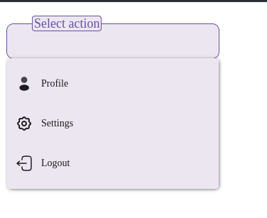

# Документация компонента SelectField

## Обзор
Компонент `SelectField` представляет собой выпадающее меню с возможностью выбора одного значения из списка. Поддерживает различные размеры, состояния ошибки, вспомогательный текст и адаптивное поведение для разных размеров экрана.

## Внешний вид  



## Пропсы

### Основные пропсы
| Проп              | Тип                                      | По умолчанию       | Описание                                                                 |
|-------------------|------------------------------------------|--------------------|-------------------------------------------------------------------------|
| `onChange`        | `(value: string) => void`               | -                  | Обработчик изменения выбранного значения                               |
| `value`          | `string`                                | -                  | Выбранное значение                                                     |
| `placeholder`    | `string`                                | -                  | Подсказка в поле                                                       |
| `className`      | `string`                                | -                  | Дополнительные классы                                                  |
| `items`         | `(IOption \| string)[]`                | - (обязательный)   | Список элементов для выбора                                           |
| `border`        | `boolean`                               | -                  | Показать рамку                                                         |
| `name`          | `string`                                | -                  | Имя поля                                                               |
| `error`         | `boolean`                               | -                  | Флаг ошибки                                                            |
| `onFocus`       | `(e: React.FocusEvent) => void`        | -                  | Обработчик фокуса                                                      |
| `onBlur`        | `(e: React.FocusEvent) => void`        | -                  | Обработчик потери фокуса                                               |
| `container`     | `HTMLElement \| null`                  | -                  | Контейнер для портала меню                                             |
| `screensize`    | `ScreenSize`                           | `ScreenSize.STANDART` | Размер экрана (определяет адаптивное поведение)                       |
| `style`         | `React.CSSProperties`                  | -                  | Стили контейнера                                                       |
| `inputRef`      | `React.RefObject<HTMLInputElement>`    | -                  | Ref для input элемента                                                 |
| `size`          | `"small" \| "medium" \| "large"`      | `"medium"`         | Размер компонента                                                      |
| `transparent`   | `boolean`                              | -                  | Прозрачный фон                                                         |
| `helperText`    | `string`                               | -                  | Вспомогательный текст                                                  |
| `errorText`     | `string`                               | -                  | Текст ошибки (имеет приоритет над helperText)                          |
| `disabled`      | `boolean`                              | `false`            | Отключенное состояние                                                  |

### Интерфейс IOption
| Поле        | Тип               | Описание                          |
|-------------|-------------------|-----------------------------------|
| `title`    | `string`          | Отображаемый текст элемента       |
| `value`    | `string`          | Значение элемента                 |
| `icon`     | `React.ReactNode` | Иконка элемента                   |
| `disabled` | `boolean`         | Отключенное состояние элемента    |

### ScreenSize (тип размера экрана)
```typescript
enum ScreenSize {
  MOBILE = 'mobile',
  STANDART = 'standart'
}
```

## Примеры использования

### Простой выбор из строк
```jsx
<SelectField
  items={["Вариант 1", "Вариант 2", "Вариант 3"]}
  onChange={(value) => console.log(value)}
  placeholder="Выберите вариант"
/>
```

### Выбор из объектов с иконками
```jsx
<SelectField
  items={[
    { title: "Русский", value: "ru", icon: <RuFlagIcon /> },
    { title: "Английский", value: "en", icon: <EnFlagIcon /> }
  ]}
  value={currentLanguage}
  onChange={setLanguage}
  placeholder="Выберите язык"
/>
```

### С ошибкой и вспомогательным текстом
```jsx
<SelectField
  items={[...]}
  error={!isValid}
  errorText="Обязательное поле"
  helperText="Выберите один из вариантов"
/>
```

### Адаптивный вариант
```jsx
<SelectField
  items={[...]}
  screensize={isMobile ? ScreenSize.MOBILE : ScreenSize.STANDART}
  container={isMobile ? modalContainer : null}
/>
```

## Особенности реализации

1. **Адаптивность**:
   - На мобильных устройствах (`ScreenSize.MOBILE`) меню открывается в полноэкранном режиме
   - На десктопах - как обычное выпадающее меню

3. **Гибкость данных**:
   - Поддерживает как простые строки, так и объекты с дополнительными данными
   - Автоматически определяет заголовок по значению

4. **Визуальные состояния**:
   - Ошибка (красная подсветка + текст ошибки)
   - Отключенное состояние
   - Разные размеры (small, medium, large)
   - Прозрачный фон

## Рекомендации по использованию

1. Для управляемых компонентов используйте связку `value` + `onChange`
2. Для сложных данных используйте интерфейс `IOption`
3. Всегда указывайте `container` иначе список разместится в `body`
4. Используйте `helperText` и `errorText` для лучшего UX
