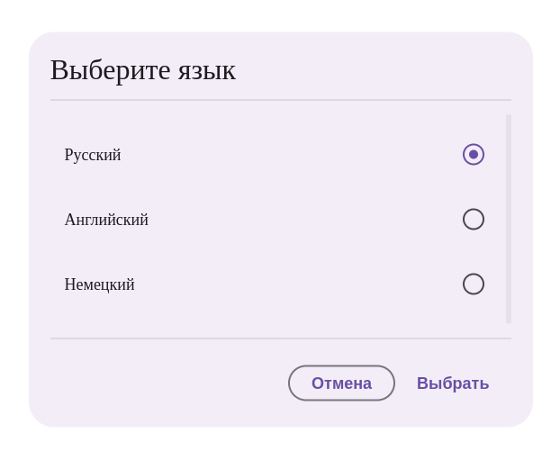

# Документация компонента SelectionDialog

## Обзор
Компонент `SelectionDialog` представляет собой диалоговое окно для выбора одного варианта из списка. Поддерживает отображение дополнительной информации для каждого элемента и возможность отключения отдельных вариантов.

## Внешний вид  



## Пропсы

### Основные пропсы
| Проп              | Тип                     | По умолчанию       | Описание                                                                 |
|-------------------|-------------------------|--------------------|-------------------------------------------------------------------------|
| `onSuccess`       | (data: T) => void       | -                  | Колбек с выбранными данными при подтверждении                          |
| `items`          | `SelectionItem<T>[]`    | - (обязательный)   | Список элементов для выбора                                           |
| `header`         | string                  | - (обязательный)   | Заголовок диалога                                                     |
| `onHide`         | () => void              | -                  | Колбек при закрытии диалога                                           |
| `name`          | string                  | "selection_dialog" | Имя группы radio кнопок                                               |
| `noHide`        | boolean                 | false              | Не закрывать диалог после выбора                                      |
| `confirmText`   | string                  | "Выбрать"          | Текст кнопки подтверждения                                            |
| `cancelText`    | string                  | "Отмена"           | Текст кнопки отмены                                                   |
| `defaultValue`  | T                       | -                  | Выбранное значение по умолчанию                                       |
| `style`        | React.CSSProperties     | -                  | Стили контейнера диалога                                              |

### Интерфейс SelectionItem
| Поле           | Тип       | Описание                          |
|----------------|-----------|-----------------------------------|
| `title`       | string    | Основной текст элемента          |
| `description` | string    | Дополнительное описание          |
| `data`        | T         | Связанные данные элемента       |
| `disabled`    | boolean   | Отключить элемент               |

## Примеры использования

### Простой выбор
```jsx
<SelectionDialog
  header="Выберите язык"
  items={[
    { title: "Русский", data: "ru" },
    { title: "Английский", data: "en" }
  ]}
  onSuccess={(lang) => console.log(lang)}
/>
```

### С дополнительными параметрами
```jsx
<SelectionDialog
  header="Выберите тариф"
  items={[
    { 
      title: "Базовый", 
      description: "100 сообщений/мес", 
      data: { id: 1, price: 100 } 
    },
    { 
      title: "Премиум", 
      description: "Безлимитные сообщения", 
      data: { id: 2, price: 300 } 
    }
  ]}
  confirmText="Подтвердить"
  defaultValue={{ id: 1, price: 100 }}
  onSuccess={(tariff) => console.log(tariff)}
/>
```

### С отключенными элементами
```jsx
<SelectionDialog
  header="Выберите способ оплаты"
  items={[
    { title: "Карта", data: "card" },
    { title: "PayPal", data: "paypal", disabled: true },
    { title: "Криптовалюта", data: "crypto" }
  ]}
  onSuccess={(method) => console.log(method)}
/>
```

## Особенности работы

1. **Управление состоянием**:
   - Поддерживается выбор значения по умолчанию через `defaultValue`
   - При `noHide=true` диалог не закрывается после выбора
   - Сброс выбора при закрытии

2. **Доступность**:
   - Используются ARIA-атрибуты для доступности
   - Поддерживается клавиатурная навигация
   - Отключенные элементы помечаются соответствующими атрибутами

3. **Валидация**:
   - Кнопка подтверждения блокируется, если ничего не выбрано

## Рекомендации по использованию

1. Для сложных данных используйте generic-тип T
2. Всегда указывайте понятные заголовки (`header`) и тексты элементов (`title`)
3. Используйте `description` для дополнительной информации
4. Для обязательного выбора не используйте `noHide`

```jsx
// Пример с обработкой выбора
const [selectedTheme, setSelectedTheme] = useState<string>();

return (
  <SelectionDialog
    header="Выберите тему"
    items={[
      { title: "Светлая", data: "light" },
      { title: "Темная", data: "dark" },
      { title: "Системная", data: "system" }
    ]}
    onSuccess={setSelectedTheme}
    confirmText="Применить"
  />
);
```