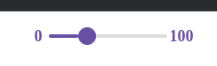

# Документация компонента Slider

## Обзор
Компонент `Slider` представляет собой ползунок для выбора значений из диапазона с возможностью отображения текущего значения, минимальных/максимальных границ и tooltip'а при фокусе.

## Внешний вид  



## Пропсы

### Основные пропсы
| Проп          | Тип                                      | По умолчанию | Описание                                                                 |
|---------------|------------------------------------------|--------------|-------------------------------------------------------------------------|
| `min`         | `number`                                 | 0            | Минимальное значение                                                   |
| `max`         | `number`                                 | 100          | Максимальное значение                                                  |
| `step`        | `number`                                 | -            | Шаг изменения значения                                                 |
| `value`       | `number`                                 | -            | Текущее значение                                                       |
| `onChange`    | `(e: React.ChangeEvent<HTMLInputElement>) => void` | - | Обработчик изменения значения                                     |
| `showMinMax`  | `boolean`                                | -            | Показывать минимальное и максимальное значения                         |
| `onFocus`     | `(e: React.FocusEvent<HTMLInputElement>) => void` | - | Обработчик фокуса                                                 |
| `onBlur`      | `(e: React.FocusEvent<HTMLInputElement>) => void` | - | Обработчик потери фокуса                                          |
| `onMouseUp`   | `(e: React.MouseEvent<HTMLInputElement>) => void` | - | Обработчик отпускания кнопки мыши                                |
| `style`       | `React.CSSProperties`                    | -            | Стили контейнера                                                       |
| `showValue`   | `boolean`                                | true         | Показывать текущее значение в tooltip'е                               |
| `disabled`    | `boolean`                                | false        | Отключенное состояние                                                  |

## Примеры использования

### Базовый слайдер
```jsx
const [value, setValue] = useState(50);

<Slider 
  min={0}
  max={100}
  value={value}
  onChange={(e) => setValue(Number(e.target.value))}
/>
```

### Слайдер с границами и кастомным шагом
```jsx
<Slider
  min={10}
  max={1000}
  step={10}
  showMinMax
/>
```

### Отключенный слайдер
```jsx
<Slider
  value={75}
  disabled
/>
```

## Особенности реализации

1. **Визуализация**:
   - Заполненная часть ползунка подсвечивается основным цветом
   - При фокусе появляется tooltip с текущим значением
   - Поддерживается отображение минимального/максимального значений

2. **Логика**:
   - Используется хелпер `map` для расчета позиции значения в диапазоне
   - Ширина заполненной части рассчитывается динамически
   - Поддерживаются все стандартные события input-элемента

3. **Доступность**:
   - Полностью нативный input[type="range"]
   - Поддерживает клавиатурное управление (стрелки, PageUp/PageDown)

## Рекомендации по использованию

1. Для управляемого компонента используйте связку `value` + `onChange`
2. Для больших диапазонов указывайте `step` для удобства выбора
3. Используйте `showMinMax` для лучшего UX, когда границы неочевидны

```jsx
// Пример сложного использования
const [temperature, setTemperature] = useState(20);

return (
  <div className="temperature-control">
    <h3>Температура: {temperature}°C</h3>
    <Slider
      min={-30}
      max={50}
      step={0.5}
      value={temperature}
      onChange={(e) => setTemperature(Number(e.target.value))}
      showMinMax
      style={{ width: '300px' }}
    />
  </div>
);
```