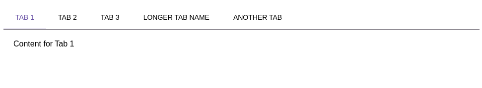

# Компонент Tabs (`<Tabs />`)

Компонент вкладок с возможностью прокрутки и кастомизации.

## Внешний вид  



## Пропсы

| Пропс                  | Тип                     | По умолчанию     | Описание |
|------------------------|-------------------------|------------------|----------|
| `tabs`                 | `Tab[]` (обязательный)  | -                | Массив объектов вкладок |
| `scrollAmount`         | `number`                | `150`            | Количество пикселей для прокрутки |
| `tabClassName`         | `string`                | `''`             | Дополнительные классы для вкладок |
| `tabContainerClassName`| `string`                | `''`             | Дополнительные классы для контейнера вкладок |
| `activeTabClassName`   | `string`                | `'active'`       | Класс для активной вкладки |
| `onTabClick`           | `(index: number) => void` | -              | Колбэк при клике на вкладку |
| `activeTabIndex`       | `number`                | -                | Управление активной вкладкой извне |

### Тип `Tab`

```ts
type Tab = {
  label: string;          // Текст вкладки
  content: React.ReactNode; // Контент вкладки
};
```

## Примеры использования

### Базовое использование

```jsx
<Tabs tabs={[
  { label: 'Вкладка 1', content: <div>Контент 1</div> },
  { label: 'Вкладка 2', content: <div>Контент 2</div> }
]} />
```

### Управляемый режим

```jsx
const [activeTab, setActiveTab] = useState(0);

<Tabs 
  tabs={[...]} 
  activeTabIndex={activeTab}
  onTabClick={setActiveTab}
/>
```

### Кастомизация стилей

```jsx
<Tabs 
  tabs={[...]}
  tabClassName="custom-tab"
  activeTabClassName="custom-active"
  tabContainerClassName="custom-container"
/>
```

## Особенности

1. **Автоматическая прокрутка** - при большом количестве вкладок появляются кнопки прокрутки
2. **Два режима работы**:
   - Неуправляемый (внутреннее состояние)
   - Управляемый (через `activeTabIndex`)
3. **Доступность**:
   - Поддержка навигации с клавиатуры (стрелки влево/вправо)
4. **Анимация**:
   - Плавное перемещение индикатора активной вкладки
   - Плавная прокрутка вкладок
