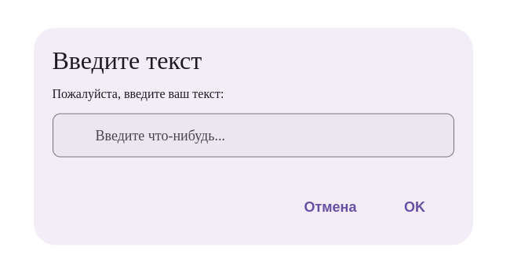

# Документация компонента TextDialog

## Обзор
Компонент `TextDialog` представляет собой диалоговое окно с текстовым полем ввода, поддерживающее различные типы данных и валидацию.


## Внешний вид  



## Пропсы

### Основные пропсы
| Проп              | Тип                     | По умолчанию | Описание                                                                 |
|-------------------|-------------------------|--------------|-------------------------------------------------------------------------|
| `text`            | string                  | -            | Текст сообщения перед полем ввода                                      |
| `header`          | string                  | -            | Заголовок диалога                                                      |
| `onSuccess`       | (data: string) => void  | -            | Колбек с введенным текстом при подтверждении                           |
| `onHide`          | () => void              | -            | Колбек при закрытии диалога                                            |
| `placeholder`     | string                  | -            | Плейсхолдер для поля ввода                                             |
| `type`            | HTMLInputTypeAttribute  | "text"       | Тип поля ввода (text, number, password и др.)                          |
| `min`             | number                  | 0            | Минимальное значение для type="number"                                 |
| `max`             | number                  | 100          | Максимальное значение для type="number"                                |
| `styleContainer`  | React.CSSProperties     | -            | Стили контейнера диалога                                               |
| `defaultValue`    | string                  | ""           | Начальное значение поля                                                |
| `confirmText`     | string                  | "OK"         | Текст кнопки подтверждения                                             |
| `cancelText`      | string                  | "Отмена"     | Текст кнопки отмены                                                    |
| `validate`        | (value: string) => boolean | -         | Функция валидации введенного значения                                  |

## Примеры использования

### Простой текстовый диалог
```jsx
<TextDialog
  header="Введите имя"
  text="Пожалуйста, введите ваше имя:"
  onSuccess={(name) => console.log(name)}
  placeholder="Имя пользователя"
/>
```

### Числовой ввод с валидацией
```jsx
<TextDialog
  header="Введите возраст"
  type="number"
  min={18}
  max={99}
  defaultValue="25"
  onSuccess={(age) => console.log(age)}
/>
```

### Кастомная валидация
```jsx
<TextDialog
  header="Введите email"
  type="email"
  validate={(value) => /\S+@\S+\.\S+/.test(value)}
  onSuccess={(email) => console.log(email)}
/>
```

## Особенности работы

1. **Валидация**:
   - Для числовых полей автоматическая проверка на диапазон (min/max)
   - Поддержка кастомных валидационных функций
   - Кнопка подтверждения блокируется при невалидных данных

2. **Типы ввода**:
   - Поддерживаются все стандартные HTML-типы input
   - Для числовых полей автоматическая коррекция значений

3. **Обработка событий**:
   - `onSuccess` вызывается только с валидными данными
   - `onHide` вызывается при любом закрытии диалога

## Рекомендации по использованию

1. Для числовых полей всегда указывайте `min` и `max`
2. Для сложных валидаций используйте кастомную функцию `validate`
3. Обрабатывайте `onHide` для корректного закрытия диалога
4. Используйте `defaultValue` для предзаполнения поля

```jsx
// Пример управления видимостью
const [isOpen, setIsOpen] = useState(false);

const handleSubmit = (value) => {
  console.log("Введенное значение:", value);
  setIsOpen(false);
};

return (
  <>
    <button onClick={() => setIsOpen(true)}>Открыть диалог</button>
    {isOpen && (
      <TextDialog
        header="Пример"
        text="Введите данные:"
        onSuccess={handleSubmit}
        onHide={() => setIsOpen(false)}
      />
    )}
  </>
);
```