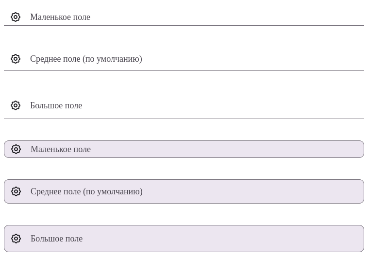

# Документация компонента TextField

## Обзор
Компонент `TextField` представляет собой универсальное поле ввода текста с поддержкой различных состояний, валидации, иконок и адаптивного поведения.

## Внешний вид  



## Пропсы

### Основные пропсы
| Проп                | Тип                                      | По умолчанию | Описание                                                                 |
|---------------------|------------------------------------------|--------------|-------------------------------------------------------------------------|
| `onChange`         | `(e: React.ChangeEvent<HTMLInputElement>) => void` | - | Обработчик изменения значения                                         |
| `onClick`         | `(e: React.MouseEvent<HTMLInputElement>) => void` | - | Обработчик клика по полю                                             |
| `name`            | `string`                                 | -            | Имя поля                                                               |
| `value`           | `number` \| `string`                     | -            | Значение поля                                                         |
| `placeholder`     | `string`                                 | -            | Подсказка в поле                                                      |
| `validEmptyValue` | `boolean`                                | -            | Валидация пустого значения                                            |
| `className`       | `string`                                 | -            | Дополнительные классы                                                 |
| `onFocus`         | `(e: React.FocusEvent<HTMLInputElement>) => void` | - | Обработчик фокуса                                                   |
| `onBlur`         | `(e: React.FocusEvent<HTMLInputElement>) => void` | - | Обработчик потери фокуса                                            |
| `error`          | `boolean`                                | -            | Флаг ошибки                                                           |
| `icon`           | `React.ReactNode`                        | -            | Иконка для поля                                                       |
| `onClear`        | `() => void`                             | -            | Обработчик очистки поля                                               |
| `border`         | `boolean`                                | -            | Показать рамку                                                        |
| `password`       | `boolean`                                | -            | Парольное поле                                                        |
| `readOnly`       | `boolean`                                | -            | Только для чтения                                                     |
| `type`           | `string`                                 | "text"       | Тип поля                                                              |
| `transparent`    | `boolean`                                | -            | Прозрачный фон                                                        |
| `min`            | `number`                                 | -            | Минимальное значение (для числовых полей)                             |
| `max`            | `number`                                 | -            | Максимальное значение (для числовых полей)                            |
| `styleContainer` | `React.CSSProperties`                    | -            | Стили контейнера                                                      |
| `inputRef`       | `React.LegacyRef<HTMLInputElement>`      | -            | Ref для input элемента                                                |
| `autoFocus`      | `boolean`                                | -            | Автоматический фокус при монтировании                                 |
| `disabled`       | `boolean`                                | -            | Отключенное состояние                                                 |
| `size`           | `"small"` \| `"medium"` \| `"large"`    | "medium"     | Размер компонента                                                     |

## Примеры использования

### Базовое текстовое поле
```jsx
<TextField 
  placeholder="Введите имя"
  onChange={(e) => console.log(e.target.value)}
/>
```

### Поле с иконкой и очисткой
```jsx
const [value, setValue] = useState('');

<TextField
  value={value}
  onChange={(e) => setValue(e.target.value)}
  onClear={() => setValue('')}
  icon={<SearchIcon />}
  placeholder="Поиск..."
/>
```

### Поле с валидацией
```jsx
<TextField
  value={email}
  onChange={setEmail}
  placeholder="Email"
  validEmptyValue
  error={!isValidEmail(email)}
/>
```

### Числовое поле
```jsx
<TextField
  type="number"
  min={0}
  max={100}
  value={age}
  onChange={(e) => setAge(e.target.value)}
  placeholder="Возраст"
/>
```

## Особенности реализации

1. **Состояния**:
   - Поддерживаются состояния фокуса (`isFocused`), заполненности (`isFilled`) и ошибки (`isError`)
   - Автоматическая валидация при изменении значения

2. **Доступность**:
   - Используются ARIA-атрибуты (`aria-invalid`, `aria-describedby`)
   - Поддерживается клавиатурная навигация

3. **Размеры**:
   - Три варианта размера: small (маленький), medium (средний), large (большой)

4. **Визуальные модификаторы**:
   - Рамка (`border`)
   - Прозрачный фон (`transparent`)
   - Состояние ошибки (`error`)
   - Отключенное состояние (`disabled`)

## Структура компонента

### DOM-структура
```html
<div class="input-field text-field [модификаторы]">
  <!-- Иконка -->
  {icon && <div class="icon-container">{icon}</div>}
  
  <!-- Контейнер ввода -->
  <div class="input-container">
    <input [атрибуты] />
    {placeholder && <label class="filled"><span>{placeholder}</span></label>}
  </div>

  <!-- Кнопка очистки -->
  {onClear && value && <div class="icon-container clear-btn"><X /></div>}
</div>
```

## Рекомендации по использованию

1. Для управляемых компонентов всегда используйте связку `value` + `onChange`
2. Для сложной валидации используйте внешний state + проп `error`
3. Для числовых полей всегда указывайте `min` и `max`
4. Используйте `onClear` для реализации кнопки очистки поля
5. Для улучшения UX сочетайте `placeholder` с плавающей меткой

```jsx
// Пример управляемого компонента с валидацией
const [email, setEmail] = useState('');
const [isValid, setIsValid] = useState(true);

const handleChange = (e: React.ChangeEvent<HTMLInputElement>) => {
  const value = e.target.value;
  setEmail(value);
  setIsValid(validateEmail(value));
};

return (
  <TextField
    value={email}
    onChange={handleChange}
    placeholder="Email"
    error={!isValid}
    validEmptyValue
  />
);
```