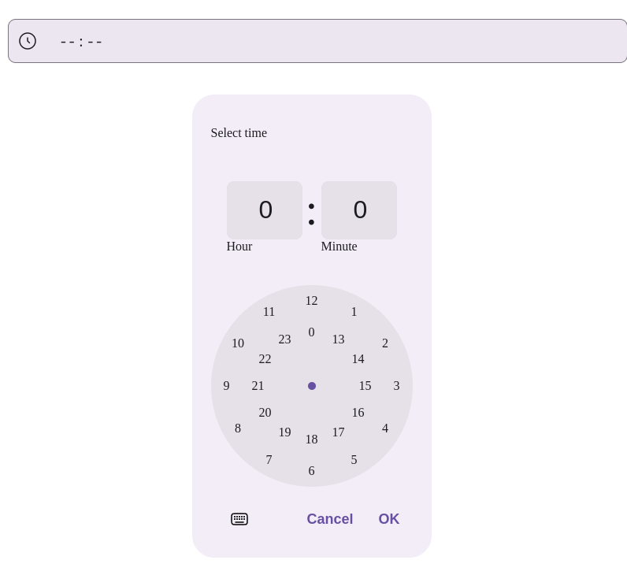

# Компонент TimeField

Поле для ввода времени с всплывающим пикером времени.

## Особенности

- Кастомный пикер времени с выбором часов и минут
- Поддержка валидации пустых значений
- Отображение состояния ошибки
- Вспомогательный текст и сообщения об ошибках
- Полная доступность (ARIA-атрибуты)
- Поддержка порталов для рендеринга пикера

## Внешний вид  



## Props (Свойства)

| Свойство | Тип | Описание | По умолчанию |
|----------|-----|----------|--------------|
| `onChange` | `(value: string, name?: string) => void` | Колбэк при изменении значения времени | - |
| `name` | `string` | Атрибут name для поля ввода | - |
| `value` | `string` | Значение времени в формате "ЧЧ:ММ" | `""` |
| `validEmptyValue` | `boolean` | Считать ли пустое значение валидным | - |
| `className` | `string` | Дополнительные CSS-классы | - |
| `error` | `boolean` | Показать состояние ошибки | - |
| `border` | `boolean` | Показать границу вокруг поля | - |
| `container` | `HTMLElement \| null` | Контейнер для рендеринга модального окна пикера | - |
| `disabled` | `boolean` | Отключено ли поле | `false` |
| `errorText` | `string` | Текст ошибки для отображения | - |
| `helperText` | `string` | Вспомогательный текст под полем | - |
| `ariaLabel` | `string` | ARIA-метка для поля ввода | - |
| `ariaLabelledby` | `string` | ID элемента, который является меткой для поля | - |
| `size` | `"small" \| "medium" \| "large"` | Размер компонента | - |
| `transparent` | `boolean` | Прозрачный фон поля | - |
| `style` | `React.CSSProperties` | Инлайн-стили компонента | - |

## Пример использования

```jsx
<TimeField 
  name="appointmentTime"
  value="14:30"
  onChange={(time) => console.log("Выбрано время:", time)}
  container={document.getElementById('modal-root')}
  border
  helperText="Выберите время приёма"
  errorText="Необходимо указать время"
  ariaLabel="Время приёма у врача"
/>
```

## Доступность

Компонент включает следующие ARIA-атрибуты:

- `aria-disabled` - состояние disabled
- `aria-invalid` - индикация ошибки
- `aria-describedby` - связь с текстом ошибки/подсказки
- `aria-labelledby` - связь с меткой
- `aria-label` - текстовая метка для скринридеров

## Взаимодействие

- Клик по полю или иконке часов открывает пикер времени
- Пикер рендерится в указанный контейнер через портал
- При выборе времени в пикере вызывается `onChange`
- Поле синхронизируется с переданным значением `value`

## Ограничения

- Поддерживается только 24-часовой формат времени
- Значение должно быть строго в формате "ЧЧ:ММ"
- Для работы портала необходимо предоставить существующий DOM-элемент в `container`